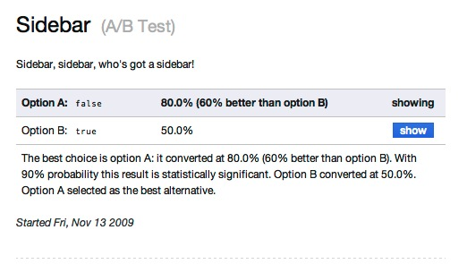

# Vanity
[](https://travis-ci.org/assaf/vanity)

Vanity is an A/B testing framework for Rails that is datastore agnostic.

*   All about Vanity: http://vanity.labnotes.org
*   On Github: http://github.com/assaf/vanity

[](http://github.com/assaf/vanity)

## A/B Testing With Rails

### **Step 1:** Start using Vanity in your Rails application

#### Step 1.1

##### Rails 3 & Rails 4 installation

Add to your Gemfile:

    gem "vanity"

(For support for older versions of Rails and Ruby 1.8, please see the [1.9.x
branch](https://github.com/assaf/vanity/tree/1-9-stable).)

#### Step 1.2

Choose a datastore that best fits your needs and preferences for storing
experiment results. Choose one of: Redis, MongoDB or an SQL database. While
Redis is usually faster, it may add additional complexity to your stack.
Datastores should be configured using a `config/vanity.yml`.

##### Redis Setup

Add to your Gemfile:

    gem "redis", ">= 2.1"
    gem "redis-namespace", ">= 1.1.0"

By default Vanity is configured to use Redis on localhost port 6379 with
database 0.

A sample `config/vanity.yml` might look like:

```yaml
test:
  collecting: false
production:
  adapter: redis
  url: redis://<%= ENV["REDIS_USER"] %>:<%= ENV["REDIS_PASSWORD"] %>@<%= ENV["REDIS_HOST"] %>:<%= ENV["REDIS_PORT"] %>/0
```

If you want to use your test environment with RSpec you will need to add an
adapter to test:

```yaml
test:
  adapter: redis
  collecting: false
```

##### MongoDB Setup

Add to your Gemfile:

```ruby
gem "mongo", "~> 2.0" # For Mongo 1.x support see Vanity versions 2.1 and below.
```

A sample `config/vanity.yml` might look like:

```yaml
development:
  adapter: mongodb
  database: analytics
test:
  collecting: false
production:
  adapter: mongodb
  database: analytics
```

##### SQL Database Setup

Vanity supports multiple SQL stores (like MySQL, MariaDB, Postgres, Sqlite,
etc.) using ActiveRecord, which is built into Rails. If you're using
DataMapper, Sequel or another persistence framework, add to your Gemfile:

```ruby
    gem "active_record"
```

A sample `config/vanity.yml` might look like:

```yaml
development:
  adapter: active_record
  active_record_adapter: sqlite3
  database: db/development.sqlite3
test:
  adapter: active_record
  active_record_adapter: default
  collecting: false
production:
  active_record_adapter: postgresql
  <% uri = URI.parse(ENV['DATABASE_URL']) %>
  host:     <%= uri.host %>
  username: <%= uri.username %>
  password: <%= uri.password %>
  port:     <%= uri.port %>
  database: <%= uri.path.sub('/', '') %>
```

If you're going to store data in the database, run the generator and
migrations to create the database schema:

```sh
$ rails generate vanity
$ rake db:migrate
```

#### Step 1.3

Turn Vanity on, and pass a reference to a method that identifies a user. For
example:

```ruby
class ApplicationController < ActionController::Base
  use_vanity :current_user
end
```

For more information, please see the [identity
documentation](http://vanity.labnotes.org/identity.html).

### **Step 2:** Define your first A/B test

This experiment goes in the file `experiments/price_options.rb`:

```ruby
ab_test "Price options" do
  description "Mirror, mirror on the wall, who's the better price of all?"
  alternatives 19, 25, 29
  metrics :signups
end
```

If the experiment uses a metric as above ("signups"), there needs to be a
corresponding ruby file for that metric, `experiments/metrics/signups.rb`.

```ruby
metric "Signup (Activation)" do
  description "Measures how many people signed up for our awesome service."
end
```

### **Step 3:** Present the different options to your users

```erb
<h2>Get started for only $<%= ab_test :price_options %> a month!</h2>
```

### **Step 4:** Measure conversion

Conversions are created via the `Vanity.track!` method. For example:

```ruby
class SignupController < ApplicationController
  def signup
    @account = Account.new(params[:account])
    if @account.save
      Vanity.track!(:signups)
      redirect_to @acccount
    else
      render action: :offer
    end
  end
end
```

### **Step 5:** Check the report:

```sh
vanity report --output vanity.html
```

To view metrics and experiment results with the dashboard in Rails 3 & Rails
4:

```sh
rails generate controller Vanity --helper=false
```

In `config/routes.rb`, add:

```ruby
get '/vanity' =>'vanity#index'
get '/vanity/participant/:id' => 'vanity#participant'
post '/vanity/complete'
post '/vanity/chooses'
post '/vanity/reset'
post '/vanity/enable'
post '/vanity/disable'
post '/vanity/add_participant'
get '/vanity/image'
```

The controller should look like:

```ruby
class VanityController < ApplicationController
  include Vanity::Rails::Dashboard
  layout false  # exclude this if you want to use your application layout
end
```

## Registering participants with Javascript

If robots or spiders make up a significant portion of your sites traffic they
can affect your conversion rate. Vanity can optionally add participants to the
experiments using asynchronous javascript callbacks, which will keep many
robots out. For those robots that do execute Javascript and are well-behaved
(like Googlebot), Vanity filters out requests based on their user-agent
string.

In Rails, add the following to `application.rb`:

```ruby
Vanity.configure do |config|
  config.use_js = true

  # Optionally configure the add_participant route that is added with Vanity::Rails::Dashboard,
  # make sure that this action does not require authentication
  # config.add_participant_route = '/vanity/add_participant'
end
```

Then add `<%= vanity_js %>` to any page that calls an A/B test **after calling
`ab_test`**. `vanity_js` needs to be included after your call to ab_test so
that it knows which version of the experiment the participant is a member of.
The helper will render nothing if the there are no ab_tests running on the
current page, so adding `vanity_js` to the bottom of your layouts is a good
option. Keep in mind that if you set `use_js` and don't include `vanity_js` in
your view no participants will be recorded.

## Compatibility

Here's what's tested and known to work:

    Ruby 2.1
      Persistence: Redis, Mongo, ActiveRecord
      Rails: 3.2, 4.1, 4.2
    Ruby 2.2
      Persistence: Redis, Mongo, ActiveRecord
      Rails: 3.2, 4.1, 4.2
    Ruby 2.3
      Persistence: Redis, Mongo, ActiveRecord
      Rails: 3.2, 4.1, 4.2

## Testing

For view tests/specs or integration testing, it's handy to set the outcome of
an experiment. This may be done using the `chooses` method. For example:

```ruby
Vanity.playground.experiment(:price_options).chooses(19)
```

See [the docs on testing](http://vanity.labnotes.org/ab_testing.html#test) for more.

## Updating documentation

Documenation is written in the textile format in the [docs](docs/) directory,
and is hosted on Github Pages. To update the docs commit changes to the master
branch in this repository, then:

```sh
bundle exec rake docs # output HTML files into html/
git checkout gh-pages
mv html/* . # Move generated html to the top of the repo
git commit # Add, commit and push any changes!
```

Go ahead and target a pull request against the `gh-pages` branch.

## Contributing

*   Fork the project
*   Please use a feature branch to make your changes, it's easier to test them
    that way
*   To set up the test suite run `bundle`, then run `appraisal install` to
    prepare the test suite to run against multiple versions of Rails
*   Fix, patch, enhance, document, improve, sprinkle pixie dust
*   Tests. Please. Run `appraisal rake test`, of if you can, `rake test:all`.
    (This project uses Travis CI where the test suite is run against multiple
    versions of ruby, rails and backends.)
*   Send a pull request on GitHub


## Credits/License

Original code, copyright of Assaf Arkin, released under the MIT license.

Documentation available under the Creative Commons Attribution license.

For full list of credits and licenses:
http://vanity.labnotes.org/credits.html.
